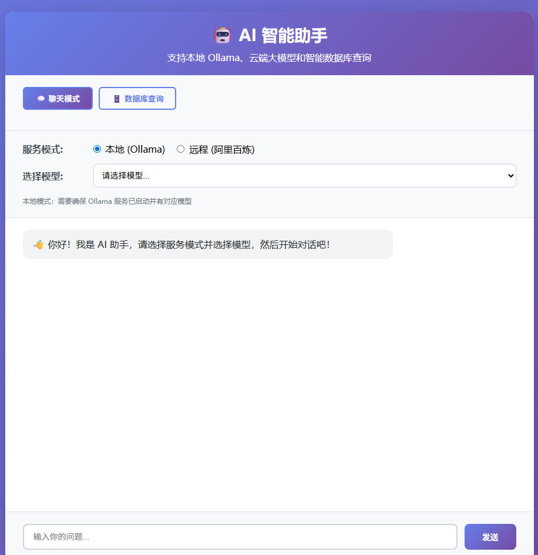
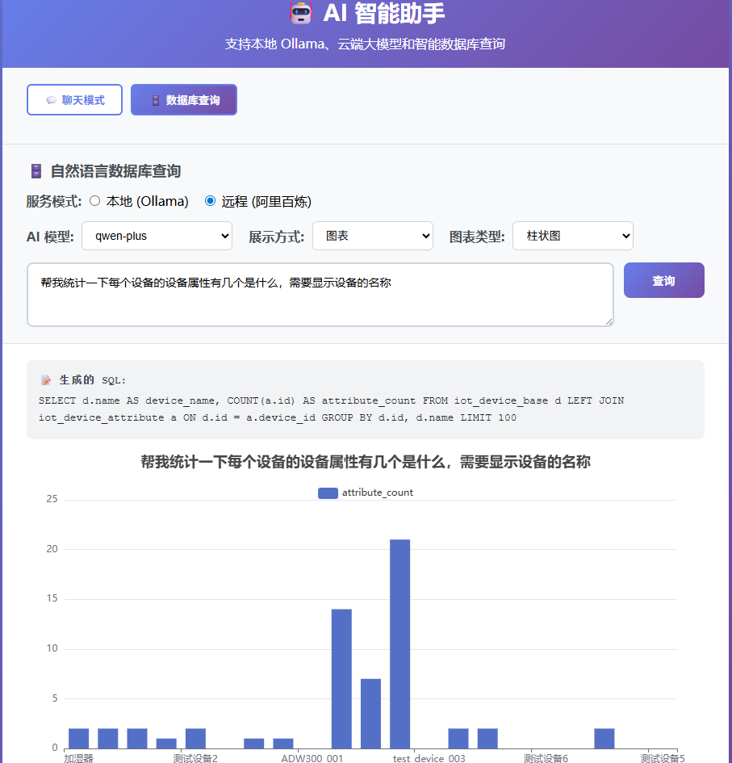

# 🤖 AI 智能助手

一个基于 Spring AI 的智能助手应用，支持本地 Ollama、云端大模型（阿里百炼）和智能数据库查询功能。

## ✨ 功能特性

### 1. 💬 聊天模式
- **本地模型**：支持 Ollama 本地部署的 AI 模型
  - qwen2.5-coder:7b-instruct-q4_K_M
  - deepseek-coder:6.7b-instruct-q4_K_M
  - qwen3.6:latest
  - qwen3.6:35b-a3b
  - qwen3.5:9b

- **云端模型**：支持阿里百炼大模型
  - qwen-plus
  - qwen-max
  - qwen-turbo
  - qwen-long

### 2. 🗄️ 数据库查询模式
- **自然语言转 SQL**：用自然语言提问，AI 自动生成 SQL 查询语句
- **智能执行**：自动验证 SQL 安全性，只允许 SELECT 查询
- **多格式展示**：
  - 📊 表格展示：以 HTML 表格形式展示查询结果
  - 📈 图表展示：使用 ECharts 生成可视化图表
    - 柱状图
    - 折线图
    - 饼图
    - 散点图

## 📸 界面截图

### 聊天模式



聊天模式支持选择本地 Ollama 模型或云端阿里百炼模型，提供流畅的 AI 对话体验。

### 数据库查询模式



数据库查询模式支持自然语言查询，AI 自动生成 SQL 并以表格或图表形式展示结果。

## 🛠️ 技术栈

- **后端框架**：Spring Boot 3.2.0
- **AI 框架**：Spring AI 0.8.1
- **数据库**：PostgreSQL
- **AI 模型**：
  - 云端：阿里百炼 (DashScope)
  - 本地：Ollama
- **前端**：原生 HTML + JavaScript + ECharts 5.4.3
- **连接池**：HikariCP
- **构建工具**：Maven

## 📋 环境要求

- Java 17+
- Maven 3.6+
- PostgreSQL 数据库（用于数据库查询功能）
- Ollama（可选，用于本地模型）
- 阿里百炼 API Key（可选，用于云端模型）

##  快速开始

### 1. 克隆项目

```bash
git clone https://github.com/xyzstar/my-spring-ai.git
cd my-spring-ai
```

### 2. 配置应用

编辑 `src/main/resources/application.yml`：

```yaml
spring:
  # 数据库配置（用于数据库查询功能）
  datasource:
    url: jdbc:postgresql://192.168.1.130:5432/my_ai?currentSchema=public
    username: postgres
    password: iot.2024
    driver-class-name: org.postgresql.Driver
  
  # AI 配置
  ai:
    # 阿里百炼配置
    dashscope:
      api-key: your-dashscope-api-key
      chat:
        options:
          model: qwen-plus
    
    # Ollama 配置
    ollama:
      base-url: http://192.168.1.150:11434
      chat:
        options:
          model: qwen2.5-coder:7b-instruct-q4_K_M

server:
  port: 8000
```

### 3. 启动应用

```bash
mvn clean spring-boot:run
```

### 4. 访问应用

打开浏览器访问：http://localhost:8000

## 📖 使用指南

### 聊天模式

1. 选择服务模式：
   - **本地 (Ollama)**：使用本地部署的 AI 模型
   - **远程 (阿里百炼)**：使用云端大模型

2. 选择对应的 AI 模型

3. 在输入框中输入你的问题

4. 点击"发送"或按 Enter 键

5. 等待 AI 回复

### 数据库查询模式

1. 切换到"数据库查询"标签页

2. 选择服务模式（本地/远程）

3. 选择 AI 模型

4. 选择展示方式：
   - **表格**：直接显示数据表格
   - **图表**：可选择柱状图、折线图、饼图或散点图

5. 输入自然语言问题，例如：
   - "查询所有用户的姓名和邮箱"
   - "统计每个部门的员工数量"
   - "显示最近一个月的销售趋势"
   - "帮我统计一下每个设备的设备属性有几个是什么，需要显示设备的名称"

6. 点击"查询"按钮

7. 系统会自动：
   - 获取数据库 Schema 信息
   - 使用 AI 生成 SQL 语句
   - 验证 SQL 安全性
   - 执行查询
   - 以表格或图表形式展示结果

## 🔌 API 接口

### 执行数据库查询

```bash
POST /api/database/query
Content-Type: application/json

{
  "question": "查询所有用户",
  "model": "qwen-plus",
  "displayType": "table",  // 或 "chart"
  "chartType": "bar"       // bar/line/pie/scatter
}
```

### 获取表列表

```bash
GET /api/database/tables
```

### 获取表的列信息

```bash
GET /api/database/table/{tableName}/columns
```

### 获取完整 Schema 信息

```bash
GET /api/database/schema
```

##  安全特性

1. **SQL 注入防护**：
   - 只允许 SELECT 查询
   - 禁止 INSERT、UPDATE、DELETE、DROP 等危险操作
   - AI 生成的 SQL 会经过安全验证

2. **查询限制**：
   - 自动添加 LIMIT 100，防止返回过多数据
   - 连接池管理，防止资源耗尽

3. **超时控制**：
   - 前端 60 秒超时限制
   - 防止长时间等待

## ️ 项目结构

```
my-spring-ai/
├── src/
│   ├── main/
│   │   ├── java/com/x/ai/ai/
│   │   │   ├── config/
│   │   │   │   └── AiConfig.java           # AI 配置类
│   │   │   ├── controller/
│   │   │   │   ├── TestController.java     # 测试控制器
│   │   │   │   └── DatabaseController.java # 数据库查询 API
│   │   │   ├── service/
│   │   │   │   ├── AIAssistantService.java         # AI 助手服务
│   │   │   │   ├── AiService.java                  # AI 服务
│   │   │   │   ├── ProgrammingAssistantService.java # 编程助手服务
│   │   │   │   ├── DatabaseQueryService.java       # 数据库查询服务
│   │   │   │   └── DatabaseSchemaService.java      # 数据库 Schema 服务
│   │   │   ├── model/
│   │   │   │   ├── DatabaseQueryRequest.java       # 查询请求模型
│   │   │   │   └── DatabaseQueryResponse.java      # 查询响应模型
│   │   │   └── AIServiceApplication.java           # 应用启动类
│   │   └── resources/
│   │       ├── static/
│   │       │   └── index.html            # 前端界面
│   │       └── application.yml           # 应用配置
│   └── test/
└── pom.xml
```

## 📝 配置说明

### 数据库配置

```yaml
spring:
  datasource:
    url: jdbc:postgresql://192.168.1.130:5432/my_ai?currentSchema=public
    username: postgres
    password: iot.2024
    driver-class-name: org.postgresql.Driver
    hikari:
      maximum-pool-size: 10
      minimum-idle: 5
      connection-timeout: 30000
```

### AI 模型配置

#### 阿里百炼（云端）

```yaml
spring:
  ai:
    dashscope:
      api-key: sk-xxxxxxxxxxxxxxxxxxxxxxxx
      chat:
        options:
          model: qwen-plus
```

#### Ollama（本地）

```yaml
spring:
  ai:
    ollama:
      base-url: http://localhost:11434
      chat:
        options:
          model: qwen2.5-coder:7b-instruct-q4_K_M
```

## 💡 示例查询

以下是一些可以使用自然语言查询的示例：

- "列出所有员工的姓名和部门"
- "统计每个城市的用户数量"
- "显示本月销售额最高的产品"
- "查询年龄大于30岁的用户"
- "按月份统计订单数量"
- "找出工资最高的前5名员工"
- "帮我统计一下每个设备的设备属性有几个是什么，需要显示设备的名称"

## ⚠️ 注意事项

1. 确保 PostgreSQL 数据库可访问
2. 确保 AI 服务可用（阿里百炼 API 或 Ollama 服务）
3. 数据库需要有实际的表和数据才能查询
4. 复杂的自然语言问题可能需要更强大的 AI 模型
5. 使用本地 Ollama 模型时，确保 Ollama 服务已启动并有对应模型

## 🚀 扩展建议

1. **添加更多图表类型**：如面积图、雷达图等
2. **支持多轮对话**：记住上下文，支持追问
3. **查询历史**：保存用户的查询历史
4. **导出功能**：支持导出 CSV、Excel 等格式
5. **权限控制**：添加用户认证和授权
6. **性能优化**：添加查询缓存、分页等功能
7. **更多 AI 模型**：支持更多本地和云端模型

## 📄 许可证

本项目采用 MIT 许可证

## 🙏 致谢

- [Spring AI](https://spring.io/projects/spring-ai)
- [阿里百炼](https://dashscope.aliyun.com/)
- [Ollama](https://ollama.com/)
- [ECharts](https://echarts.apache.org/)

##  联系方式

如有问题或建议，欢迎提交 Issue 或 Pull Request。
